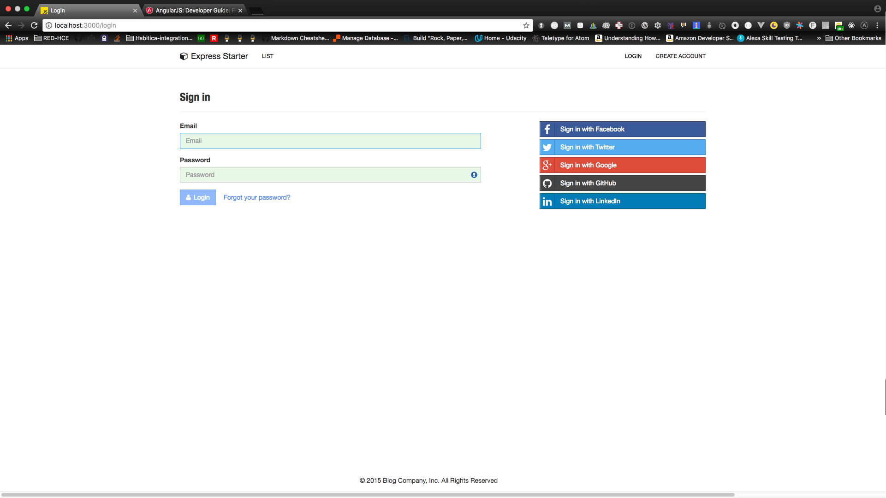

Express + PostgreSQL Blog
=======================



Check-out the [live demo](https://whispering-tor-53151.herokuapp.com/) 

Started with a boilerplate for **Node.js** web applications, which uses PostgreSQL database

**PostgreSQL 9.3** which introduced a new `JSON` field type, which allows not only to store any JSON object, but also query it as well. And you still have a proper and *ACID*-compliant relational database!

Features
--------

- really secure **Local Authentication** using Email and Password (**bcrypt** is used)
- **OAuth 1.0a Authentication** via Twitter
- **OAuth 2.0 Authentication** via Facebook, Google, GitHub, LinkedIn
- Flash notifications
- MVC Project Structure
- Rails 3.1-style asset pipeline by connect-assets 
- LESS stylesheets (auto-compiled without any Gulp/Grunt hassle)
- Bootstrap 3 + Flat UI + iOS7
- Contact Form (powered by Sendgrid by default, but Mailgun and Mandrill can be used as well, or sparkpost for responsive html emails)
- **Account Management**
 - Gravatar
 - Profile Details
 - Change Password
 - Forgot Password
 - Reset Password
 - Password Strength Meter (based on [zxcvbn](https://github.com/dropbox/zxcvbn))
 - Link multiple OAuth strategies to one account
 - Unlink OAuth accounts
 - Delete Account
- CSRF protection
- Blog 

Prerequisites
-------------

- [PostgreSQL](http://www.postgresql.org/download/) or [MySQL](http://www.mysql.com/downloads/)
- [Node.js](http://nodejs.org)

Getting Started
---------------

The easiest way to get started is to clone the repository:

```
# Get the latest snapshot
$ git clone https://github.com/Rob-Rychs/express-postgresql.git myblog
$ cd myblog
$ git remote rm origin

# Install NPM dependencies
$ npm install -d

# Adjust settings to your needs
$ vim config/secrets.js

# Create .env file with DATABASE_URL = 'postgres://@localhost:5432/prod'
$ echo 'DATABASE_URL = 'postgres://@localhost:5432/prod' > .env

# Start the app with nodemon
$ nodemon app.js
```
If you don't have nodemon installed you can install it globally with `npm i -g nodemon`

In `config/secrets.js` you may want to change database configuration. You don't have to change all API keys, because they will work on your localhost without any hassle. You will need to change API keys, when deploying application to the server.

**Note:** It is recommended to store your API keys and other sensitive data as environment variables. This project uses the 'dotenv' package to retrieve the contents of a '.env' file in your root directory. To store your variables create a '.env' file in the root directory (the same place that app.js is) and place you environment variables in the following format:

```bash
SESSION_SECRET=YourSessionSecretGoesHere
```
Then, make sure you add this line
```bash
.env
```
to your .gitignore file.
and you can now access the SESSION_SECRET variable in the secrets.js file as:
```bash
process.env.SESSION_SECRET
```
**Note:** I highly recommend installing [Nodemon](https://github.com/remy/nodemon).
It watches for any changes in your  node.js app and automatically restarts the
server. Once installed, instead of `node app.js` use `nodemon app.js`. It will
save you a lot of time in the long run, because you won't need to manually
restart the server each time you make a small change in code. To install, run
`sudo npm install -g nodemon`.

Obtaining API Keys
------------------

To use any of the included APIs or OAuth authentication methods, you will need
to obtain appropriate credentials: Client ID, Client Secret, API Key, or
Username & Password. You will need to go through each provider to generate new
credentials.

**Important Notice:** I have included dummy keys and passwords for
all API examples to get you up and running even faster. But don't forget to update
them with *your credentials* when you are ready to deploy an app.


- Visit [Google Cloud Console](https://cloud.google.com/console/project)
- Click on the **Create Project** button
- Enter *Project Name*, then click on **Create** button
- Then click on *APIs & auth* in the sidebar and select *API* tab
- Click on **Google+ API** under *Social APIs*, then click **Enable API**
- Next, under *APIs & auth* in the sidebar click on *Credentials* tab
- Click on **Create new Client ID** button
- Select *Web Application* and click on **Configure Consent Screen**
- Fill out the required fields then click on **Save**
- In the *Create Client ID* modal dialog:
 - **Application Type**: Web Application
 - **Authorized Javascript origins**: http://localhost:3000
 - **Authorized redirect URI**: http://localhost:3000/auth/google/callback
- Click on **Create Client ID** button
- Copy and paste *Client ID* and *Client secret* keys into `config/secrets.js`

**Note:** When you ready to deploy to production don't forget to
add your new url to *Authorized Javascript origins* and *Authorized redirect URI*,
e.g. `http://my-awesome-app.herokuapp.com` and
`http://my-awesome-app.herokuapp.com/auth/google/callback` respectively.
The same goes for other providers.

<hr>


- Visit [Facebook Developers](https://developers.facebook.com/)
- Click **Apps > Create a New App** in the navigation bar
- Enter *Display Name*, then choose a category, then click **Create app**
- Copy and paste *App ID* and *App Secret* keys into `config/secrets.js`
 - *App ID* is **clientID**, *App Secret* is **clientSecret**
- Click on *Settings* on the sidebar, then click **+ Add Platform**
- Select **Website**
- Enter `http://localhost:3000` for *Site URL*

**Note:** After a successful sign in with Facebook, a user will be redirected back to home page with appended hash `#_=_` in the URL. It is *not* a bug. See this [Stack Overflow](https://stackoverflow.com/questions/7131909/facebook-callback-appends-to-return-url) discussion for ways to handle it.

<hr>


- Go to [Account Settings](https://github.com/settings/profile)
- Select **Applications** from the sidebar
- Then inside **Developer applications** click on **Register new application**
- Enter *Application Name* and *Homepage URL*
- For *Authorization Callback URL*: http://localhost:3000/auth/github/callback
- Click **Register application**
- Now copy and paste *Client ID* and *Client Secret* keys into `config/secrets.js`

<hr>


- Sign in at [https://apps.twitter.com/](https://apps.twitter.com/)
- Click **Create a new application**
- Enter your application name, website and description
- For **Callback URL**: http://127.0.0.1:3000/auth/twitter/callback
- Go to **Settings** tab
- Under *Application Type* select **Read and Write** access
- Check the box **Allow this application to be used to Sign in with Twitter**
- Click **Update this Twitter's applications settings**
- Copy and paste *Consumer Key* and *Consumer Secret* keys into `config/secrets.js`

<hr>


- Sign in at [LinkedIn Developer Network](http://developer.linkedin.com/)
- From the account name dropdown menu select **API Keys**
 - *It may ask you to sign in once again*
- Click **+ Add New Application** button
- Fill out all the *required* fields
 - **OAuth 2.0 Redirect URLs**: http://localhost:3000/auth/linkedin/callback
 - **JavaScript API Domains**: http://localhost:3000
- For **Default Scope** make sure *at least* the following is checked:
 - `r_basicprofile`
- Finish by clicking **Add Application** button
- Copy and paste *API Key* and *Secret Key* keys into `config/secrets.js`
 - *API Key* is your **clientID**
 - *Secret Key* is your **clientSecret**

<hr>


- [Sign up](http://stripe.com) or log into your [dashboard](https://manage.stripe.com)
- Click on your profile and click on Account Settings
- Then click on [API Keys](https://manage.stripe.com/account/apikeys)
- Copy the **Secret Key**. and add this into `config/secrets.js`

<hr>


- Go to https://sendgrid.com/user/signup
- Sign up and **confirm** your account via the *activation email*
- Then enter your SendGrid *Username* and *Password* into `config/secrets.js`

<hr>


- Go to http://www.mailgun.com
- Sign up and add your *Domain Name*
- From the domain overview, copy and paste the default SMTP *Login* and *Password* into `config/secrets.js`

<hr>


- Go to http://mandrill.com
- Sign up and add your *Domain Name*
- From the dashboard, click on *Get SMTP credentials*
- Copy and paste the default SMTP *Login* and *Password* into `config/secrets.js`

Project Structure
-----------------

| Name                               | Description                                                  |
| ---------------------------------- | ------------------------------------------------------------ |
| **config**/passport.js             | Passport Local and OAuth strategies, plus login middleware.  |
| **config**/secrets.js              | Your API keys, tokens, passwords and database URL.           |
| **controllers**/api.js             | Controller for /api route and all api examples.              |
| **controllers**/contact.js         | Controller for contact form.                                 |
| **controllers**/home.js            | Controller for home page (index).                            |
| **controllers**/user.js            | Controller for user account management.                      |
| **models**/**sequelize**/User.js   | Sequelize schema and model for User.                         |
| **models**/**sequelize**/Session.js| Schema for Session table (used for convenience)              |
| **models**/**sequelize**/index.js  | Tool for easy managing all of the table schemas              |
| **public**/                        | Static assets (fonts, css, js, img).                         |
| **public**/**js**/application.js   | Specify client-side JavaScript dependencies.                 |
| **public**/**js**/main.js          | Place your client-side JavaScript here.                      |
| **public**/**css**/main.less       | Main stylesheet for your app.                                |
| **public/css/themes**/default.less | Some Bootstrap overrides to make it look prettier.           |
| **views/account**/                 | Templates for *login, password reset, signup, profile*.      |
| **views/api**/                     | Templates for API Examples.                                  |
| **views/partials**/flash.ejs       | Error, info and success flash notifications.                 |
| **views/partials**/header.ejs      | Navbar partial template.                                     |
| **views/partials**/footer.ejs      | Footer partial template.                                     |
| **views**/layout.ejs               | Base template.                                               |
| **views**/home.ejs                 | Home page template.                                          |
| app.js                             | Main application file.                                       |

**Note:** There is no preference how you name or structure your views.
You could place all your templates in a top-level `views` directory without
having a nested folder structure, if that makes things easier for you.
Just don't forget to update `extends ../layout`  and corresponding
`res.render()` paths in controllers.

List of Packages
----------------

| Package                         | Description                                                           |
| ------------------------------- | --------------------------------------------------------------------- |
| bcrypt-nodejs                   | Library for hashing and salting user passwords.                       |
| connect-assets                  | Compiles LESS stylesheets, concatenates & minifies JavaScript.        |
| csso                            | Dependency for connect-assets library to minify CSS.                  |
| ejs                             | Template engine for Express.                                          |
| ejs-mate                        | Layouts and partials support for the EJS                              |
| express                         | Node.js web framework.                                                |
| body-parser                     | Express 4.0 middleware.                                               |
| cookie-parser                   | Express 4.0 middleware.                                               |
| morgan                          | Express 4.0 middleware.                                               |
| multer                          | Express 4.0 middleware.                                               |
| compression                     | Express 4.0 middleware.                                               |
| errorhandler                    | Express 4.0 middleware.                                               |
| method-override                 | Express 4.0 middleware.                                               |
| serve-favicon                   | Express 4.0 middleware offering favicon serving and caching.          |
| express-flash                   | Provides flash messages for Express.                                  |
| express-session                 | Express 4.0 middleware.                                               |
| express-validator               | Easy form validation for Express.    
| knex                            | SQL query builder (useful but not mandatory)                          |
| less                            | LESS compiler. Used implicitly by connect-assets.                     |
| lusca                           | CSRF middleware.                     
| neo-async                       | Utility library that provides asynchronous control flow.              |
| passport                        | Simple and elegant authentication library for node.js                 |
| passport-facebook               | Sign-in with Facebook plugin.                                         |
| passport-github                 | Sign-in with GitHub plugin.                                           |
| passport-google-oauth           | Sign-in with Google plugin.                                           |
| passport-twitter                | Sign-in with Twitter plugin.                                          |
| passport-local                  | Sign-in with Username and Password plugin.                            |
| passport-linkedin-oauth2        | Sign-in with LinkedIn plugin.                                         |
| passport-oauth                  | Allows you to set up your own OAuth 1.0a and OAuth 2.0 strategies.    |
| pg                              | PostgreSQL client                                                     |
| pg-hstore                       | Module for handling JSON data in Postgres (required if you use JSON)  |
| request                         | Simplified HTTP request library.                                      |
| sequelize                       | Multi-dialect ORM for node.js                                         |
| SendGrid                        | Library for sending emails through SendGrid platform.                 |
| lodash                          | Handy JavaScript utlities library.                                    |
| uglify-js                       | Dependency for connect-assets library to minify JS.                   |
| validator                       | Used in conjunction with express-validator in **controllers/api.js**. |
| mocha                           | Test framework.                                                       |
| expect.js                       | BDD/TDD assertion library.                                            |
| supertest                       | HTTP assertion library.

Sequelize Cheatsheet
-------------------

#### Find all users:
```js
db.User.findAll()
  .then(function(users) {
    console.log(users);
  })
  .catch(function(err) {
    console.error(err);
  });
```

#### Find a user by email:
```js
var userEmail = 'example@gmail.com';
db.User.findOne({ where: { email: userEmail }})
  .then(function(user) {
    console.log(user);
  })
  .catch(function(err) {
    console.error(err);
  });
```

#### Find 5 most recent user accounts:
```js
db.User
  .findAll({
    limit: 5,
    order: [ ['id', 'DESC'] ]
  })
  .then(function(users) {
    console.log(users);
  })
  .catch(function(err) {
    console.error(err);
  });
```

License
-------

The MIT License (MIT)

Copyright (c) 2017 Rob-Rychs

Permission is hereby granted, free of charge, to any person obtaining a copy of this software and associated documentation files (the "Software"), to deal in the Software without restriction, including without limitation the rights to use, copy, modify, merge, publish, distribute, sublicense, and/or sell copies of the Software, and to permit persons to whom the Software is furnished to do so, subject to the following conditions:

The above copyright notice and this permission notice shall be included in all copies or substantial portions of the Software.

THE SOFTWARE IS PROVIDED "AS IS", WITHOUT WARRANTY OF ANY KIND, EXPRESS OR IMPLIED, INCLUDING BUT NOT LIMITED TO THE WARRANTIES OF MERCHANTABILITY, FITNESS FOR A PARTICULAR PURPOSE AND NONINFRINGEMENT. IN NO EVENT SHALL THE AUTHORS OR COPYRIGHT HOLDERS BE LIABLE FOR ANY CLAIM, DAMAGES OR OTHER LIABILITY, WHETHER IN AN ACTION OF CONTRACT, TORT OR OTHERWISE, ARISING FROM, OUT OF OR IN CONNECTION WITH THE SOFTWARE OR THE USE OR OTHER DEALINGS IN THE SOFTWARE.
